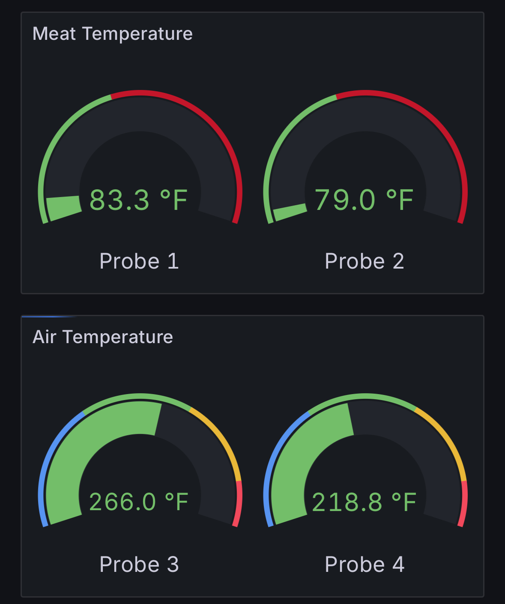
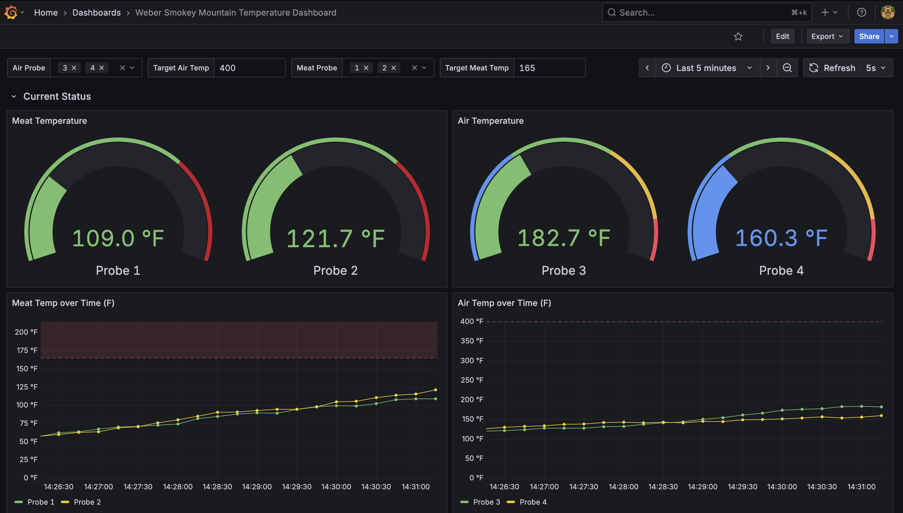
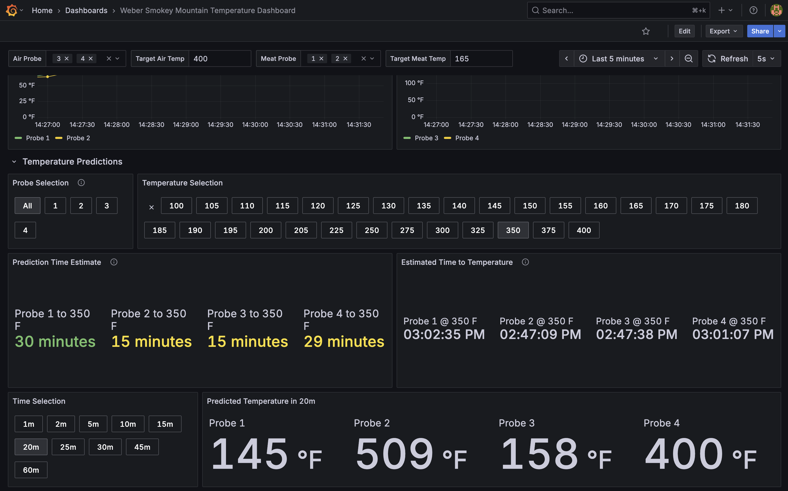

# smoke-db
Dashboard for ThermoPro based temperature sensing for meat smoking and grilling. 

Tested for ThermoPro TP-25 quad-probe meat thermometer. 

## Screenshots

   

 

 
 

## Project Structure
- `python/`: contains code and scripts for connecting to ThermoPro TP-25 and scraping the temperature sensee by the device probes.
    - `probe_reader.py` is the main file that connects to the device and runs the main loop. 
    - `test.py` is a test file used for mocking the temperature probe device for the purposes of testing and developing the grafana dashboard. 
- `docker/`: contains docker compose file, prometheus configuraiton, and a copy of the latest grafana dashbaord, for running locally the entire project locally.

- `setup.sh`: create and configure python virtual envrionment. This requires `virtualenv` and Python 3.11 installed.  
- `start.sh`: bash script to start the `probe_reader.py` script to collect temperature information, as well as start supporting tools locally via `docker-compose`

## Architecture
- `python/probe_reader.py` connects to a nearby TP-25 temperature probe, collects the temperature data every 2-5 seconds, and exposes temperature info in OpenMetrics (Prometheus) format on localhost:8000. This is invoked via `start.sh`
- `docker/docker-compose.yml` creates the following containers:
    - `prom/prometheus:v3.5.0`
        - Time Series Database (TSDB) for long term collection and storage of temperature data
    - `grafana/grafana:12.1.0`
        - Web Server and Dashboard Software for visualization, and alerting 
